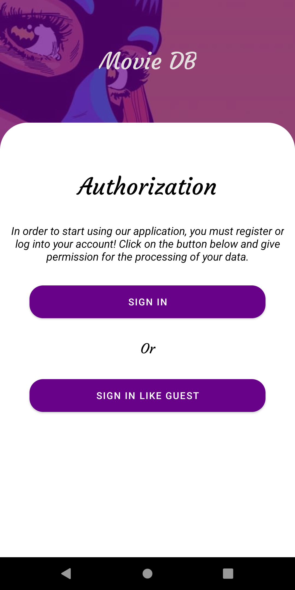
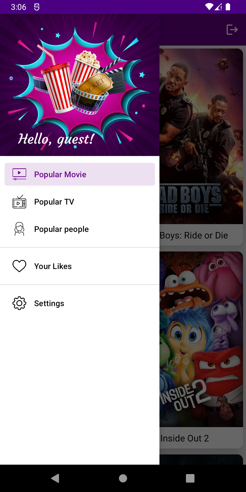
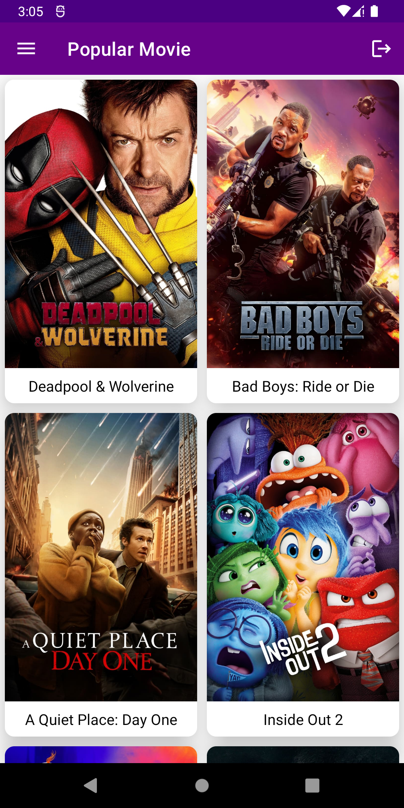
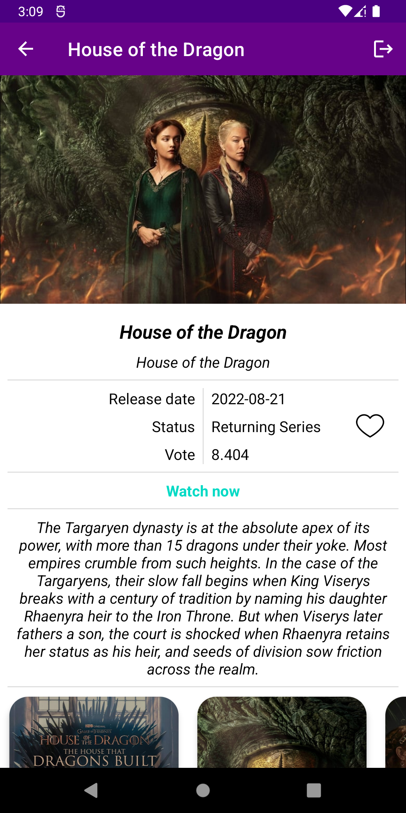
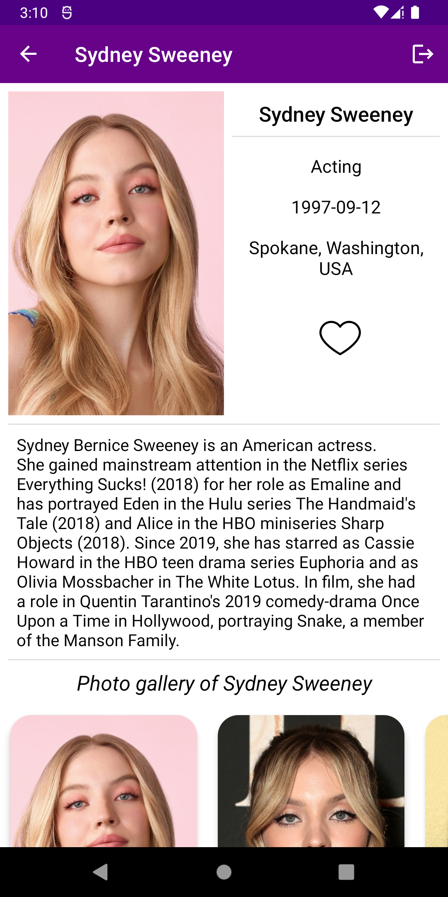
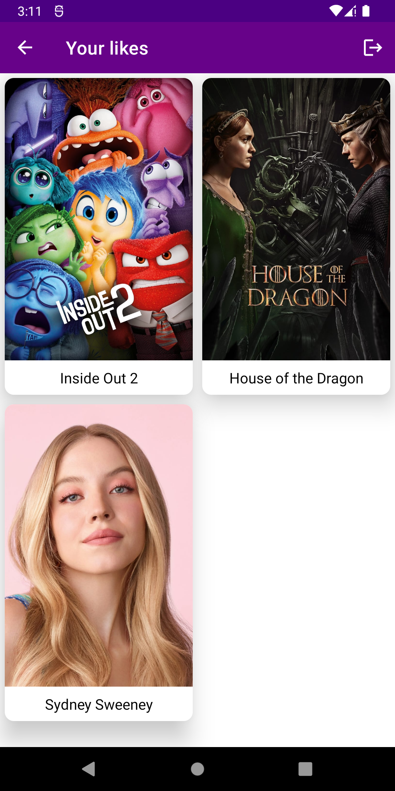

# TheMovieDB

TheMovieDB is an Android application designed to help you search for and view information about movies. 
With this app, you can easily find new movies, get detailed information about them, and view ratings and reviews.

## Technologies used

- DataBinding
- MVVM
- Firebase
- ViewPager
- AndroidX Navigation
- Retrofit
- Coroutines
- Paging
- Glide
- Hilt
- Room
- Timber Logging

## Application

### Auth Screen

### Menu

### Popular Movie Screen

### Detail Movie Screen

### Detail TV show Screen

### Detail People Screen

### Your Likes Screen

